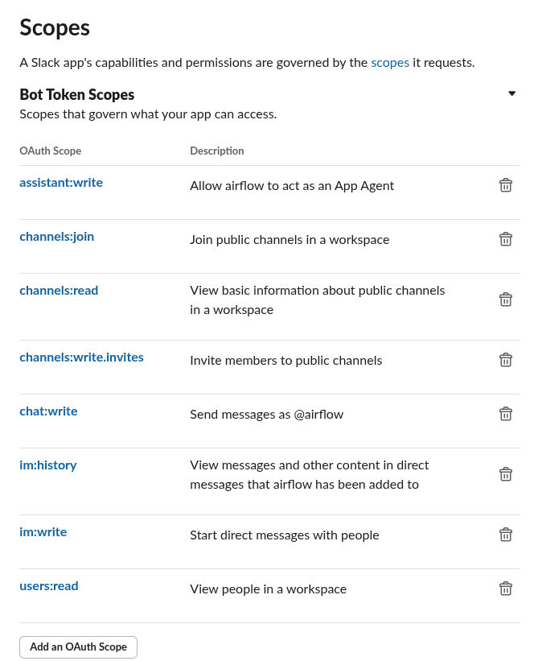

# 🚀 Automatic Fraud Detection

## 📌 Overview

Automatic Fraud Detection is a machine learning-based system designed to identify fraudulent transactions in real-time. The system integrates with a payment API and leverages Kafka, PostgreSQL, Airflow, and AWS EC2 for efficient data processing and automation.

---

## 🛠 Installation

### 📌 Model Training

To train the fraud detection model, follow these steps:

```bash
cd mlflow
docker build -t automatic-fraud-detection-mlflow .
cd ..
./run.sh
```

### 📊 Consuming Payment Data

1. **Create the database**: Ensure you have a PostgreSQL database named `automatic-fraud-detection`.
2. **Launch Kafka service**:

```bash
cd kafka
docker compose up -d
```

⚠️ If only one container appears instead of two, try the following command to remove old volumes:

```bash
docker compose down -v
```

3. **Start Kafka producer & consumer**:

```bash
cd kafka
python app/producer.py
python app/consumer.py
```

---

## ☁️ Deploying on AWS EC2

1. **Create an EC2 instance** and install all required packages for training.
2. **Save the instance** as an Amazon Machine Image (AMI).
3. **Generate an SSH key pair** and store it in the `secrets` folder inside Airflow.

---

## ♻️ Airflow Setup

1. **Initialize and start Airflow**:

```bash
cd airflow
docker compose up airflow-init
docker compose up -d
```

2. **Import variables** from a JSON file located in the `secrets` folder.
3. **Create the following Airflow connections**:

| Connection ID      | Type     | Host         | Database                    | Login | Password | Port | Extra                      |
| ------------------ | -------- | ------------ | --------------------------- | ----- | -------- | ---- | -------------------------- |
| `aws_default`      | AWS      | N/A          | N/A                         | N/A   | N/A      | N/A  | N/A                        |
| `postgres_default` | Postgres | ep-small-xxx | `automatic-fraud-detection` | `xxx` | `xxx`    | 5432 | `{ "sslmode": "require" }` |
| `slack_default`    | Slack    | N/A          | N/A                         | N/A   | N/A      | N/A  | N/A                        |

---

## 💬 Slack Integration

1. Manage access via the [Slack API](https://api.slack.com/apps/).
2. **Create a Slack App**, generate an access token, and set permissions.

📖 **Help guide**: [How to create a Slack bot](https://help.thebotplatform.com/en/articles/7233667-how-to-create-a-slack-bot)



---

## 🎯 Next Steps

- Add dashboard to manage frauds

🚀 **Happy Coding!**
